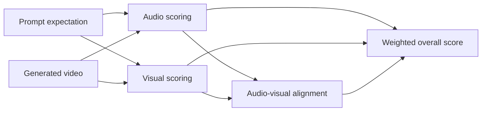

# PianoBench

PianoBench is a compact diagnostic benchmark for measuring whether text-to-video systems can generate piano performances that **look correct, sound correct, and stay synchronized**.

The benchmark focuses on event-level instruction following rather than general visual quality. A video can depict a convincing pianist while playing the wrong pitches, adding extra notes, pressing keys in the wrong order, or placing the audio noticeably before or after the visible action. PianoBench scores those failure modes separately.

The current pilot contains:

- 25 controlled prompts across five musical task families;
- machine-readable target events for every prompt;
- 75 generated videos: one selected output per prompt from Gemini, Cosmos 3, and MiniMax H3;
- automatic audio, visual, and audio-visual alignment metrics; and
- a LaTeX benchmark paper with model-level and per-video results.

Paper source: [paper/pianobench_results.tex](paper/pianobench_results.tex)

## Benchmark design

Each family contains five prompts. The suite increases the complexity of the requested musical event while keeping the scene constrained.

| Level | Task family | Example target | Primary capability tested |
|---:|---|---|---|
| 1 | Single notes | C4 | Pitch identity, onset time, and hold duration |
| 2 | Ascending sequences | C4, D4, E4, F4 | Event count and increasing order |
| 3 | Descending sequences | F4, E4, D4, C4 | Event count and decreasing order |
| 4 | Repeated notes | C4, C4, E4, C4 | Distinct repeated presses and order |
| 5 | Chords | (C4+E4), then (F4+A4) | Simultaneity within groups and order between groups |

All prompts use the same broad controls: a stable overhead keyboard view, one visible right hand, clear white-key motion, isolated acoustic-piano audio, no unintended notes, and synchronization between each audible onset and visible press. Level 1 specifies a press at 3.0 seconds and a 0.5-second hold. Levels 2-5 specify event structure without imposing a fixed performance schedule.

There are no ground-truth videos. Correct behavior is represented by the expectation files in `data/expectations/`; the videos are generated model outputs selected by `data/manifest.json`.

## Evaluation pipeline



Every metric is reported on a scale from 0 to 1.

| Metric | Weight | What it measures |
|---|---:|---|
| Audio accuracy | 0.35 | Note count, pitch, order, onset timing, and duration |
| Visual accuracy | 0.35 | Visible note identity, press count/order, key travel, extra presses, and hand constraints |
| AV alignment | 0.30 | Temporal agreement between detected acoustic onsets and visible key presses |

The overall score is:

```text
overall = 0.35 * audio + 0.35 * visual + 0.30 * AV alignment
```

Audio scoring uses onset detection and pYIN pitch estimation for monophonic prompts, with a separate CQT-based multipitch path for chords. Visual scoring samples timestamped frames and requests a structured judgment from an image-capable model. The default judge is `gpt-5.4-mini`, configurable through `PIANOBENCH_VISION_MODEL`. Alignment greedily pairs the nearest audio and visual events; credit tapers to zero at a lag of 0.5 seconds and is intentionally independent of pitch correctness.

## Current pilot results

These are macro averages over the 25 stored prompt results for each system in the current canonical artifact.

| System label | Audio | Visual | AV alignment | Overall |
|---|---:|---:|---:|---:|
| Gemini | **0.604** | 0.720 | 0.288 | **0.550** |
| Cosmos 3† | 0.438 | **0.733** | **0.331** | 0.509 |
| MiniMax H3 | 0.456 | 0.713 | 0.251 | 0.484 |

Gemini has the strongest audio and overall averages, while Cosmos 3 has the strongest visual and alignment averages. MiniMax H3 remains visually competitive but loses more performance through cross-modal alignment, especially on multi-event prompts. The decomposition matters: for example, a model can receive a strong visual chord score while producing inaccurate notes or poorly synchronized audio.

† The stored Cosmos 3 result for Prompt 4B contains an audio fallback value of 0.700 because the detector found no usable onsets or pitches. The table matches the current paper artifact, which includes that row, but it should not be interpreted as a completely fallback-free comparison. Rerun with `--no-demo` and inspect all detail fields before using new results in a formal claim.

These results compare one selected video per prompt and system label. They are diagnostic examples, not statistically powered estimates of expected model performance or rankings of current commercial systems.

## Repository layout

```text
pianobench/
  data/
    prompts/                 shared instructions and 25 prompt files
    expectations/            machine-readable targets for Levels 1-5
    videos/                  75 generated videos organized by model and level
    manifest.json            prompt/model/video evaluation registry
  evaluation/
    evaluate.py              main evaluation entry point
    metrics/
      audio_accuracy.py
      video_accuracy.py
      av_alignment.py
    tests/                   focused metric regression tests
    results/                 generated scores.json and scores.csv
  paper/
    pianobench_results.tex   benchmark paper
    update_pianobench_results.py
  docs/                      guided setup and evaluation notes
  human_video_evaluator.py   optional local thumbs-up/down review interface
```

The manifest is the source of truth for which videos are evaluated. It currently contains exactly 25 rows for each of the three system labels.

## Setup

Use a recent Python 3 environment from the repository root:

```bash
python -m venv .venv
```

Activate it:

```powershell
# Windows PowerShell
.\.venv\Scripts\Activate.ps1
```

```bash
# macOS or Linux
source .venv/bin/activate
```

Install the Python dependencies:

```bash
python -m pip install --upgrade pip
python -m pip install -r requirements.txt
```

FFmpeg must also be available. Visual frame extraction can use the binary bundled by `imageio-ffmpeg`; reliable audio extraction may require a system FFmpeg installation on `PATH`.

Create a local `.env` file:

```dotenv
OPENAI_API_KEY=your-key-here
PIANOBENCH_VISION_MODEL=gpt-5.4-mini
```

`.env` is ignored by Git. Do not commit API credentials.

## Run the benchmark

For a research run, disable demo fallback scores:

```bash
python evaluation/evaluate.py --manifest data/manifest.json --no-demo
```

The evaluator writes:

- `evaluation/results/scores.json`: full component scores, detector observations, and event-level alignment details;
- `evaluation/results/scores.csv`: the main scalar scores in spreadsheet-friendly form.

The default mode permits soft fallback values when a detector fails: 0.700 for audio and 0.650 for visual scoring. This is convenient for pipeline demonstrations but unsafe for reporting benchmark results. Prefer `--no-demo`, then inspect `audio_details`, `video_details`, and `alignment_details` for failures rather than assuming every numeric value is valid.

To evaluate one video:

```bash
python evaluation/evaluate.py \
  --video data/videos/gemini/level1/1a.mp4 \
  --prompt-id 1A \
  --level 1 \
  --no-demo \
  --out evaluation/results/single
```

### Data and API privacy

Audio analysis runs locally. Visual evaluation extracts sampled JPEG frames and sends those frames, the requested musical events, and scoring instructions to the OpenAI Responses API. It does not upload the complete MP4. Only evaluate videos that you are authorized to transmit to that service.

## Validate the evaluator

Install pytest if it is not already available, then run:

```bash
python -m pip install pytest
python -m pytest evaluation/tests -q
```

The regression tests cover audio-scoring helpers and duration-aware video sampling, including the short-clip boundary that previously caused sequence evaluations to fall back.

## Update the paper

After generating and reviewing `evaluation/results/scores.json`, validate and regenerate every result table and aggregate in the LaTeX paper:

```bash
python paper/update_pianobench_results.py --check
python paper/update_pianobench_results.py
```

The paper uses the NeurIPS 2026 workshop style. Compiling it requires a TeX installation and the appropriate `neurips_2026.sty` file.

The corrected MiniMax Level 2-5 artifact preserves already-valid audio scores, reruns visual scoring with duration-aware frame sampling, and recomputes alignment from fresh acoustic attacks. The recovery provenance is stored on those JSON rows. MiniMax Prompts 4E and 5E happen to have genuine visual scores of 0.650; their detailed VLM observations confirm that these values are measurements rather than the old fallback.

## Add another model or generation

1. Put each video at `data/videos/<model-id>/levelN/<prompt-id>.mp4`.
2. Add the model label to the `models` list in `data/manifest.json`.
3. Add one manifest evaluation entry for each prompt/video pair.
4. Confirm that the referenced prompt exists in `data/expectations/levelN.json`.
5. Run the evaluator with `--no-demo` and audit its detailed output.

Keep prompt IDs, paths, model versions, generation settings, seeds, dates, and selection/retry decisions with any new experiment. Those details are necessary for comparisons beyond this pilot.

## Optional human review

```bash
python human_video_evaluator.py
```

This launches a local browser interface for marking videos good or bad and stores cumulative totals in `human_evaluation_results.json`. It is useful for a quick qualitative pass, but it is not currently a blinded, randomized, or inter-rater-calibrated human study.

## Scope and limitations

PianoBench is intentionally narrow. It covers one instrument, white keys in the middle register, one constrained camera view, and one selected generation per prompt/model pair. Its audio metrics are heuristic, its visual metric depends on sparse frames and a remote model judge, and its alignment score does not require the paired events to agree in pitch. Exact generator versions, seeds, and complete raw generation logs are not yet recorded for the pilot videos.

Accordingly, use PianoBench to diagnose *how* a generated performance fails. Do not treat the current numbers as a universal video-quality score or evidence of statistical superiority between model families.
